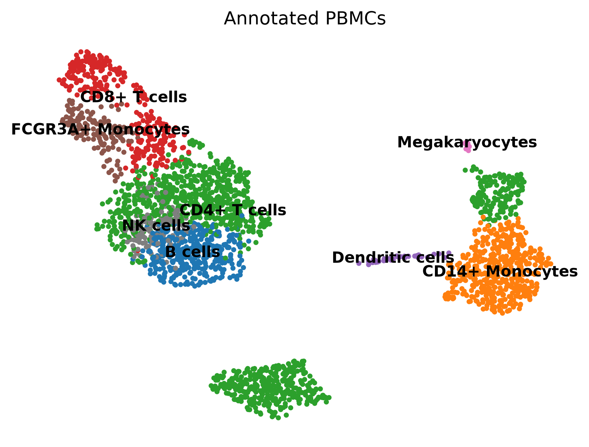

# Single-Cell RNA-Seq Analysis (PBMC 3k)

本项目记录了我的第一个单细胞转录组分析（scRNA-seq）实战流程。基于经典的 Peripheral Blood Mononuclear Cells (PBMC) 3k 数据集，使用 Python 的 `Scanpy` 流程完成了从原始数据读入、质控过滤、标准化、降维聚类到细胞类型注释的完整分析。

## 📊 核心成果：UMAP 细胞分群图

这里展示了最终注释合并后的 8 大类免疫细胞：

## 🛠️ 分析流程
1. **数据质控 (QC)**：过滤了低质量细胞（基因数少于 200 或多于 2500）和高线粒体占比（大于 5%）的死细胞。
2. **标准化与高变基因筛选**：进行 $Log1p$ 对数化，筛选出约 2000 个 Highly Variable Genes (HVGs)。
3. **降维分析**：通过 PCA 线性降维，并使用前 10 个主成分进行 UMAP 非线性降维。
4. **聚类与注释**：使用 `leiden` 算法自动聚类，并通过经典的 Marker 基因（如 *CD3D*, *MS4A1*, *CD14*）将 13 个数字群落映射为真实的免疫细胞亚群。

## 💻 运行环境
- Python 3.12
- Scanpy == 1.10.4
- AnnData == 0.10.9
- Pandas == 3.0.3
